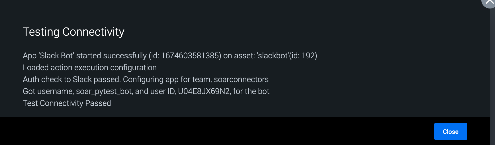

# Slack Bot

Publisher: Splunk <br>
Connector Version: 1.0.5 <br>
Product Vendor: Slack Technologies <br>
Product Name: Slack Bot <br>
Minimum Product Version: 6.3.0

Integrate with Slack using a custom Slack App

## Port Information

All external communication uses port 443.

## Authentication

SOAR's Slack Bot Connector requires multiple authentication tokens in its configuration:

- Bot Token - used to read messages from and post messages to Slack channels
- Socket Token - used to establish a websocket connection with Slack in order to listen for events
- SOAR Auth Token - used by the bot to authenticate requests to SOAR endpoints

## Create a Slack App

Creating a Slack App is required to get the proper bot token for authenticating the SOAR Slack Bot Connector.
To do this, go to <https://api.slack.com/apps> in a browser, and select **Create New App**.

[](img/slack_your_apps.png)

In the pop-up window, there are two options. Select **From scratch**. Another pop-up window will open.

Give the app a name and associate it with a Slack team/workspace. Then, click **Create App**.

[](img/slack_create_an_app.png)

On the next page, there will be general information displayed about the new app.

[](img/slack_basic_info.png)

On the same page, there is an **App Level tokens** section. This section will have a **Generate Token and
Scope** button. Click on it to open another pop-up.

Set the Token Name to **socket_token**. Just below this is an **Add Scope** button. Click it.

Add **connection:write & authorization:read** and click on **Generate**. This token will be needed during asset configuration.

[](img/slack_socket_token.png)

In the menu bar on the left, select **OAuth & Permissions**. On that page, scroll down to the
**Scopes** section and click **Add an OAuth Scope** to add scopes to your **Bot Token** and **User
Token**.

[](img/slack_add_scopes.png)

The minimum required scopes for the bot to function are shown below.

- app_mentions:read
- channels:history
- chat:write
- im:history
- im:write
- mpim:write

### Set up Socket Mode in Slack

Go to the **Your apps** option in Slack. From the menu on the left select the **Socket Mode**
option.

[](img/slack_socket_mode.png)

Once on this page, toggle on **Socket Mode**.

Then, click on the **Event Subscriptions** option which will redirect you to the
**Event Subscriptions** page. From there add the following subscriptions for bot:

[](img/slack_subscription_events.png)

### Install App on Slack

Next, click on **Install App** in the side bar. On that page, click **Install to Workspace**.

[](img/slack_install_app.png)

On the next page, click **Allow**.

[](img/slack_allow_app.png)

After authorizing the app, the next window will show the app's authorization tokens. The **Bot User
OAuth Access Token** will be required during asset configuration.

[](img/slack_auth_tokens.png)

## SOAR Configuration

### SOAR Base URL

The app uses the SOAR **Base URL** configuration to generate links to actions, so please make sure a
valid url is specified in the **System Settings**.

[](img/slack_system_settings.png)

### Automation User Token

The Slack Bot connector needs a SOAR authentication token to perform some tasks on the SOAR platform.
To get this token, it is recommended that you create a new automation user. The steps for creating
this user are as follows:

- On the SOAR platform, navigate to **Administration->User Management**

- Under **Users** , click **+ USER**

- In the **Add User** wizard, do the following:

  - Set the **User Type** to **Automation**
  - Give the user a **Username** like "Slack Automation"
  - For security reasons, accessing 127.0.0.1 is not allowed. Set **Allowed IPs** same as the
    **instance IP or "any"**. (eg : If instance IP is 10.1.18.123, set allowed IP also
    10.1.18.123)
  - Set the **Default Label** to the label seen in the Slack Bot asset's **Ingest Settings**
  - Under **Roles** , in addition to the default **Automation** role, add the **Observer** role
  - Click **CREATE**

  [](img/slack_automation_user.png)

- Once the new user is created, click on the user in the user list

- On the user's page copy the **ph-auth-token** field from the **Authorization Configuration for
  REST API** box

  [](img/slack_auth_token.png)

- The token is required during asset configuration for the **Automation User Auth Token** field.

### SOAR Slack Asset

Fill out the required values in the **Asset Definition** tab.

[](img/slack_asset_info.png)

Fill out the **Bot User OAuth Access Token**, **Socket Token**, and **Automation User Auth Token**
in the **Asset Settings** tab. See the prior sections for information on how to obtain each of these
tokens.

[](img/slack_asset_settings.png)

Click **SAVE**. You will be asked to fill in the **Ingest Settings**. The "Label to apply
to objects from this source" setting is ignored by this app, so it can be set to anything.

Click **SAVE**.

[](img/slack_ingest_settings.png)

### Test Connectivity

Now, on the **Asset Settings** page, click the **TEST CONNECTIVITY** button, which will display a
text box with progress messages. It will show the bot username and bot user ID that SOAR received
from Slack. Please ensure that these are correct.

[](img/slack_new_test_connectivity.png)

## Bot Management on SOAR

### Starting the Slack Bot

There are two options to start the Slack Bot:

#### Action

There is a "start bot" action which takes no parameters and starts the bot if it is not
already running.

#### Ingestion

Enabling ingestion will periodically run the "start bot" command at the polling interval. This
approach ensures that the bot will be started again if it ever crashes or is killed for any
reason.

### Checking the status

To check the status of the SOAR bot and restart it if not running, you can Click POLL NOW from the
INGEST SETTINGS and then POLL NOW again. The "Source ID", "Maximum containers", and "Maximum
artifacts" settings can be ignored in this case.

[](img/slack_poll_now.png)

The POLL NOW window will display the PID of the Slackbot process as well as the number of artifacts
and containers ingested (which will always be zero for this app).

### Stopping the Slack Bot

Once the SOAR Slack Bot starts running, the **stop bot** action needs to be run to stop it. Simply
disabling ingestion won't stop Slackbot.

**WARNING:** Stopping Slack Bot is required before upgrading or uninstalling the SOAR Slack Bot
connector. Otherwise, an untracked Slack Bot process may be left running on the SOAR instance.
In addition, deleting a Slack Bot asset that has Slack Bot running will not stop a running Slack Bot
process. It will silently continue in the background, untracked, unless explicitly stopped.

## Slack Commands

Once a Slack Bot asset has been configured, and Slack Bot is running on SOAR, it needs to be invited
to the channel. Then, commands can be sent from Slack to SOAR. In Slack, just mention the bot to
get a help message on running commands. All commands follow this syntax:

```
@BOT_NAME COMMAND COMMAND_PARAMETERS
```

The following is a reproduction of the same help commands the bot will respond with when prompted.
Either by specifying an invalid command/parameter or by specifying the `-h`/`--help` flag.

### General Help

```
usage: @<bot_username> [-h]
                       {debug,get_action,get_container,get_playbook,run_action,run_playbook}
                       ...

optional arguments:
  -h, --help            show this help message and exit

commands:
  {debug,get_action,get_container,get_playbook,run_action,run_playbook}
```

### Debug

```
usage: @<bot_username> debug [-h]

Print debug info pertaining to the bot running on SOAR

optional arguments:
  -h, --help  show this help message and exit
```

### Get Action

```
usage: @<bot_username> get_action [-h] [--name NAME] [--app APP]
                                  [--type ACTION_TYPE] [--sort-by {name,type}]
                                  [--sort-order {asc,desc}] [--limit LIMIT]
                                  [-s | -v]

Query for actions. Only actions matching ALL specified filters will be
returned (AND)

optional arguments:
  -h, --help            show this help message and exit
  --name NAME           The action name to filter on. Case insensitive
  --app APP             The app name to filter on. Case insensitive
  --type ACTION_TYPE    The action type to filter on. Case insensitive
  --sort-by {name,type}
                        The sort key to use (default: name)
  --sort-order {asc,desc}
                        The sort order to use (default: asc)
  --limit LIMIT         The number of results to show. Specify 0 to show all
                        results (default: 10)
  -s, --short           If specified, prints the output in a compact format
                        (default: False)
  -v, --verbose         If specified, prints extra information about actions
                        (default: False)
```

### Get Container

```
usage: @<bot_username> get_container [-h] [--id CONTAINER_ID] [--name NAME]
                                     [--tags [TAGS ...]]
                                     [--labels [LABELS ...]]
                                     [--statuses [STATUSES ...]]
                                     [--owners [OWNERS ...]]
                                     [--sort-by {id,name}]
                                     [--sort-order {asc,desc}] [--limit LIMIT]
                                     [-s]

Query for containers. Only containers matching ALL specified filters will be
returned (AND)

optional arguments:
  -h, --help            show this help message and exit
  --id CONTAINER_ID     The container ID to filter on
  --name NAME           The container name to filter on. Case insensitive
  --tags [TAGS ...]     The tags to filter on. Space-separated. Any matches
                        will be included (OR)
  --labels [LABELS ...]
                        The container labels to filter on. Space-separated.
                        Any matches will be included (OR)
  --statuses [STATUSES ...]
                        The container statuses to filter on. Space-separated.
                        Any matches will be included (OR)
  --owners [OWNERS ...]
                        The container owners to filter on. Space-separated.
                        Any matches will be included (OR)
  --sort-by {id,name}   The sort key to use (default: id)
  --sort-order {asc,desc}
                        The sort order to use (default: desc)
  --limit LIMIT         The number of results to show. Specify 0 to show all
                        results (default: 10)
  -s, --short           If specified, prints the output in a compact format
                        (default: False)
```

### Get Playbook

```
usage: @<bot_username> get_playbook [-h] [--name NAME]
                                    [--status {active,inactive,draft}]
                                    [--type PLAYBOOK_TYPE] [--repo REPO]
                                    [--sort-by {name,type}]
                                    [--sort-order {asc,desc}] [--limit LIMIT]
                                    [-s]

Query for playbooks. Only playbooks matching ALL specified filters will be
returned (AND)

optional arguments:
  -h, --help            show this help message and exit
  --name NAME           The playbook name to filter on. Case insensitive
  --status {active,inactive,draft}
                        The playbook status to filter on
  --type PLAYBOOK_TYPE  The playbook type to filter on. Case insensitive
  --repo REPO           The repo name to filter on
  --sort-by {name,type}
                        The sort key to use (default: name)
  --sort-order {asc,desc}
                        The sort order to use (default: asc)
  --limit LIMIT         The number of results to show. Specify 0 to show all
                        results (default: 10)
  -s, --short           If specified, prints the output in a compact format
                        (default: False)
```

### Run Action

```
usage: @<bot_username> run_action [-h] [-a APP_ID | -p APP_NAME]
                                  [-n ASSET_NAME | -i ASSET_ID] [--name NAME]
                                  [--type ACTION_TYPE]
                                  [--parameters [PARAMETERS ...]]
                                  container action_name

Run an app action

positional arguments:
  container             ID of the container to run the action on
  action_name           Name of the action to run

optional arguments:
  -h, --help            show this help message and exit
  -a APP_ID, --app-id APP_ID
                        The app ID to which the action belongs
  -p APP_NAME, --app-name APP_NAME
                        The app name to which the action belongs. Case-
                        insensitive
  -n ASSET_NAME, --asset-name ASSET_NAME
                        Name of the asset to run the action on. If no asset is
                        specified, the given action will run on all possible
                        assets
  -i ASSET_ID, --asset-id ASSET_ID
                        ID of the asset to run the action on. If no asset is
                        specified, the given action will run on all possible
                        assets
  --name NAME           Name for the action run (default: Slack generated
                        action)
  --type ACTION_TYPE    Type of action run (default: soarbot)
  --parameters [PARAMETERS ...]
                        List of parameter/value pairs in the format
                        param1:value1 param2:value2
```

After receiving a **run_action** command, the Slack Bot will kick off the action and send a link
to the action run page to Slack.

### Run Playbook

```
usage: @<bot_username> run_playbook [-h] (-n NAME | -i PLAYBOOK_ID) [-r REPO]
                                    container

Run a playbook

positional arguments:
  container             ID of container to run playbook on

optional arguments:
  -h, --help            show this help message and exit
  -n NAME, --name NAME  Name of the playbook to run
  -i PLAYBOOK_ID, --id PLAYBOOK_ID
                        ID of the playbook to run
  -r REPO, --repo REPO  Name of the repo the playbook is in (required if
                        playbook argument is a name, and not an ID)
```

After receiving a **run_playbook** command, the Slack Bot will start the playbook and send a
link to the container in which the playbook is running to Slack.

### Troubleshooting

The logs for the "start bot", "stop bot", and "on poll" actions are in the same place as any other SOAR action or ingestion.

The logs for the bot, however, are logged separately since the bot is its own process. These logs can be found
under `/tmp/slack_bot.log` and the log level can be controlled through the log level asset configuration.

### Configuration variables

This table lists the configuration variables required to operate Slack Bot. These variables are specified when configuring a Slack Bot asset in Splunk SOAR.

VARIABLE | REQUIRED | TYPE | DESCRIPTION
-------- | -------- | ---- | -----------
**bot_token** | required | password | Bot User OAuth Access Token |
**socket_token** | required | password | Socket Token |
**soar_auth_token** | required | password | Automation User Auth Token |
**permitted_bot_users** | optional | string | Users permitted to use bot commands. Comma seperated list of Member IDs. Leave blank to allow all users (default) |
**log_level** | optional | string | The log level for the bot |
**permit_bot_get_action** | optional | boolean | Permit 'get_action' command |
**permit_bot_run_action** | optional | boolean | Permit 'run_action' command |
**permit_bot_get_playbook** | optional | boolean | Permit 'get_playbook' command |
**permit_bot_run_playbook** | optional | boolean | Permit 'run_playbook' command |
**permit_bot_get_container** | optional | boolean | Permit 'get_container' command |

### Supported Actions

[test connectivity](#action-test-connectivity) - Tests authorization with Slack <br>
[on poll](#action-on-poll) - Start Slack Bot and make health checks to it <br>
[start bot](#action-start-bot) - Start Slack Bot <br>
[stop bot](#action-stop-bot) - Stop Slack Bot

## action: 'test connectivity'

Tests authorization with Slack

Type: **test** <br>
Read only: **True**

Checks that the provided bot token is valid and grabs information about the configured bot user.

#### Action Parameters

No parameters are required for this action

#### Action Output

No Output

## action: 'on poll'

Start Slack Bot and make health checks to it

Type: **ingest** <br>
Read only: **True**

Enabling ingestion causes the on poll action to be called every polling interval (configured in ingestion settings). The on poll action will check if Slack Bot is running; if it is not, the action will start it. No new containers or artifacts will be created by this action.

#### Action Parameters

PARAMETER | REQUIRED | DESCRIPTION | TYPE | CONTAINS
--------- | -------- | ----------- | ---- | --------
**start_time** | optional | Parameter ignored in this app | numeric | |
**end_time** | optional | Parameter ignored in this app | numeric | |
**container_id** | optional | Parameter ignored in this app | string | |
**container_count** | optional | Parameter ignored in this app | numeric | |
**artifact_count** | optional | Parameter ignored in this app | numeric | |

#### Action Output

No Output

## action: 'start bot'

Start Slack Bot

Type: **correct** <br>
Read only: **False**

This action will start Slack Bot if it is not already running.

#### Action Parameters

No parameters are required for this action

#### Action Output

DATA PATH | TYPE | CONTAINS | EXAMPLE VALUES
--------- | ---- | -------- | --------------
action_result.data | string | | |
action_result.status | string | | success failed |
action_result.message | string | | Slack Bot is already running, not going to start a new instance. |
action_result.summary | string | | |
summary.total_objects | numeric | | 1 |
summary.total_objects_successful | numeric | | 1 |

## action: 'stop bot'

Stop Slack Bot

Type: **correct** <br>
Read only: **False**

This action will stop Slack Bot if it is running.

#### Action Parameters

No parameters are required for this action

#### Action Output

DATA PATH | TYPE | CONTAINS | EXAMPLE VALUES
--------- | ---- | -------- | --------------
action_result.data | string | | |
action_result.status | string | | success failed |
action_result.message | string | | Slack Bot is not running, not going to stop it |
action_result.summary | string | | |
summary.total_objects | numeric | | 1 |
summary.total_objects_successful | numeric | | 1 |

______________________________________________________________________

Auto-generated Splunk SOAR Connector documentation.

Copyright 2025 Splunk Inc.

Licensed under the Apache License, Version 2.0 (the "License");
you may not use this file except in compliance with the License.
You may obtain a copy of the License at

http://www.apache.org/licenses/LICENSE-2.0

Unless required by applicable law or agreed to in writing,
software distributed under the License is distributed on an "AS IS" BASIS,
WITHOUT WARRANTIES OR CONDITIONS OF ANY KIND, either express or implied.
See the License for the specific language governing permissions and limitations under the License.
